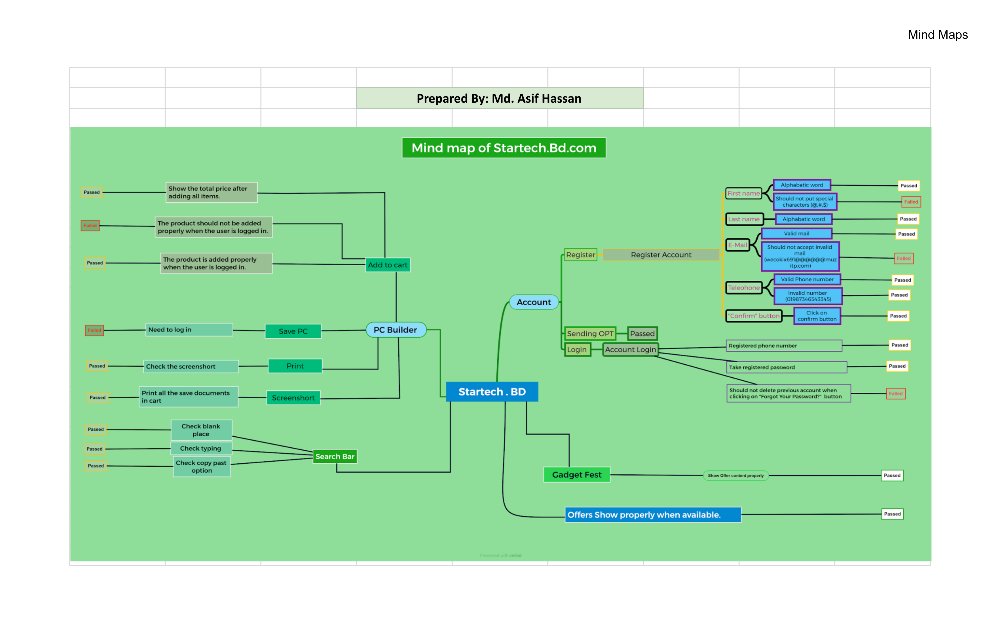
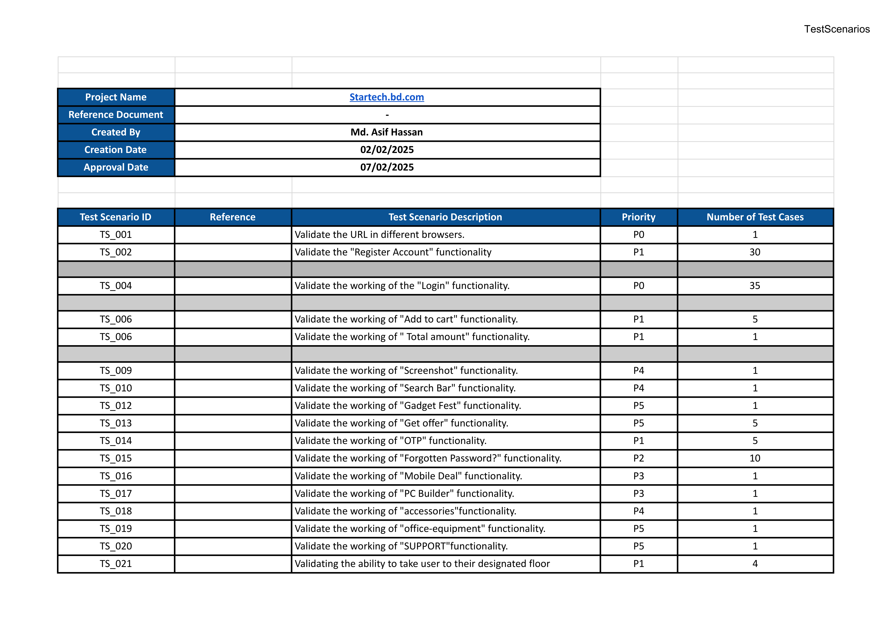
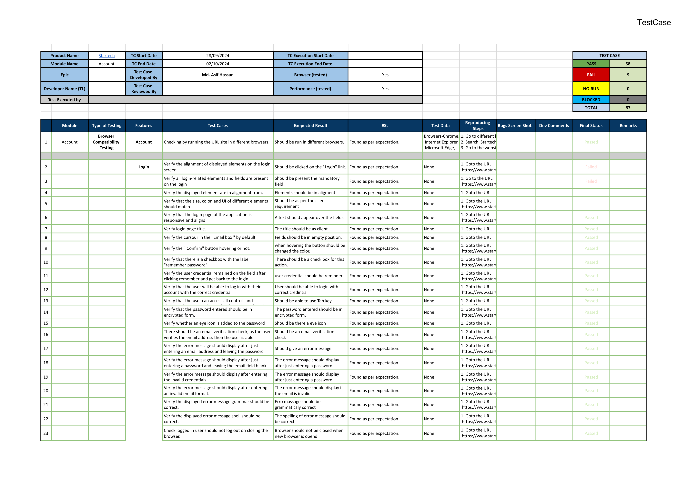
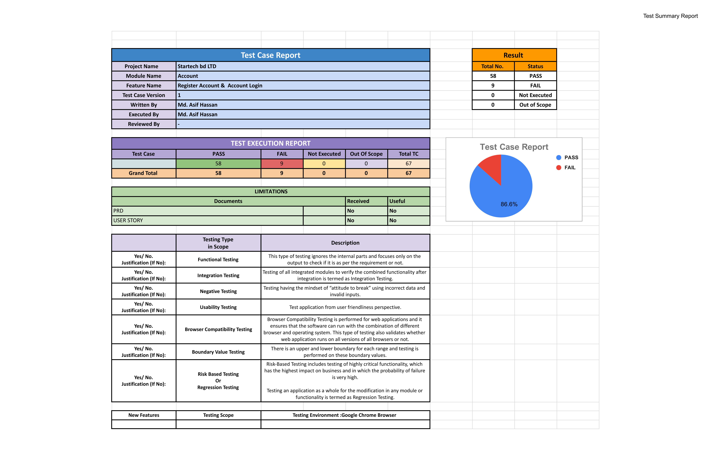
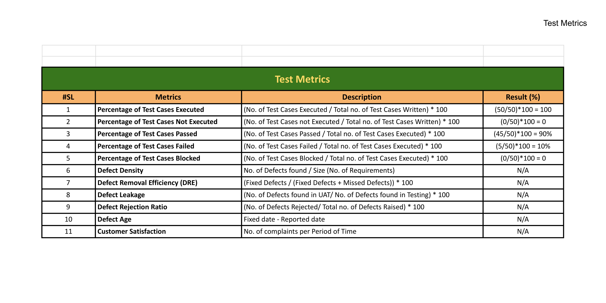
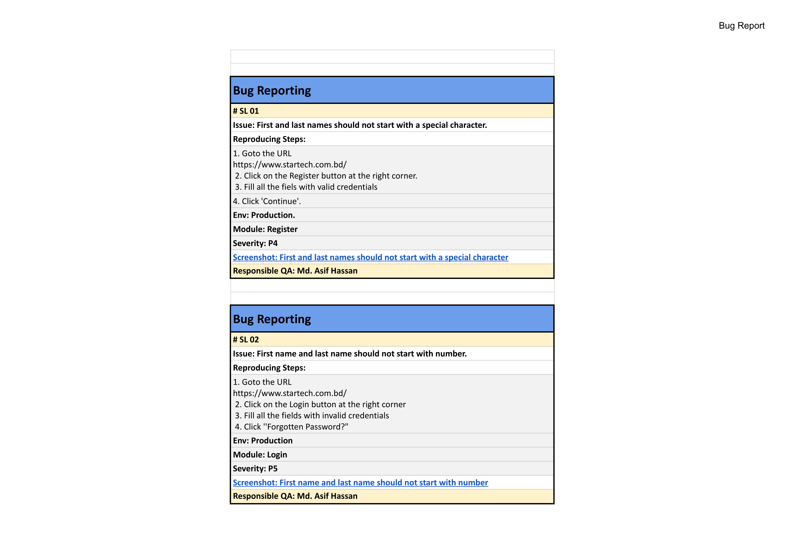

# Manual Testing Artifacts
This repository contains the **manual testing artifacts** for the **Startech.bd** website, focusing on the **Account Module**, including **Registration** and **Login** functionality. It includes test planning, execution, and reporting artifacts maintained using Excel.

## Project Overview
This project includes detailed manual testing documentation covering test planning, execution, defect tracking, and reporting. It follows the Software Testing Life Cycle to ensure a structured and effective testing process.

The goal is to provide a reusable and well-organized set of artifacts that enables QA teams to efficiently plan, execute, and analyze testing, ensuring a reliable user experience.

## Project Structure
- **Mind Maps**: Visual overview of modules and features.
-	**Test Scenarios**: High-level scenarios covering key functionalities. 
-	**Test Cases**: Step-by-step instructions with expected results and execution status.
-	**Test Summary Report**: Summary of executed test cases with pass/fail statistics. 
-	**Bug Report**: Log of defects with severity and status.
-	**Test Metrics**: Analysis of coverage, execution, and defect density.

## Technology Used
- Excel: For managing test cases, scenarios, and reports.

## Getting Started
Clone the repository and open the test-cases.xlsx file
```bash
git clone https://github.com/md-asif-hassan/manual-testing-artifacts.git
```

## Artifacts Description
### 1. **Mind Maps**
Visual representation of the Account Module covering features like Registration, Login, and related functionalities. The mind map provides a clear overview of the different components and flows tested in this project.

### 2. **Test Scenarios**
A list of high-level scenarios designed to verify the functionality of the Account Module. Each scenario ensures comprehensive coverage of the registration and login functionalities, including edge cases and input validation.

### 3. **Test Cases**
Step-by-step test cases with expected results and actual outcomes.
-	Coverage of fields such as First Name, Last Name, Email, Password, and OTP validation.
-	Positive and negative test cases for Registration and Login flows.

### 4.	**Test Summary Report**
Summarizes test execution results, including: 
-	**Total Test Cases**: 67 
-	**Passed**: 58 
-	**Failed**: 9 
-	**Not Executed**: 0 
-	**Out of Scope**: 0

A pie chart is included to visualize the **pass/fail ratio**.

### 5.	**Bug Report**
Records all defects identified during testing, including: 
-	Bug ID, Severity, and Priority
-	Steps to Reproduce 
-	Expected vs Actual Results 
-	Current Status

### 6.	**Test Metrics**
Statistical analysis of the testing effort, capturing: 
-	Test coverage 
-	Pass/fail rates 
-	Defect density

## Installation and Usage
1.	Download or clone the repository.
2.	Open the Excel files to review each testing artifact. 
	
## Summary
This manual testing artifacts for Startech.bd ensures the reliability of the Account Module, including registration and login features. It captures potential issues, validates expected functionality, and provides a comprehensive QA approach for improved product quality. Each document contributes to a structured and traceable testing process.

---
<!--- Artifact Screenshots --->
<p align="center">
  <a href="screenshots/mind_maps.png"></a>
  <a href="screenshots/test_scenarios.png"></a>
  <a href="screenshots/test_case.png"></a>
  <br><br>
  <a href="screenshots/test_summary_report.png"></a>
  <a href="screenshots/test_metrics.png"></a>
  <a href="screenshots/bug_report.png"></a>
</p>

---

## Author
**Md. Asif Hassan**
